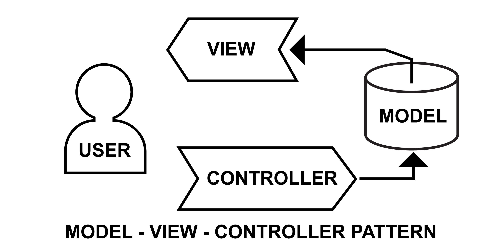

# 🚀 GitHub Stats API

Une API légère et performante développée avec **Flask** qui génère dynamiquement une carte SVG de vos statistiques GitHub. Parfait pour agrémenter votre GitHub ou votre portfolio avec un design élégant en "Dark Mode".

## 📖 À propos
Ce projet a été conçu pour offrir une alternative légère et personnalisable aux outils de statistiques GitHub existants. L'API récupère en temps réel les données de votre profil via l'API GitHub et génère à la volée une image vectorielle (SVG) optimisée.

## 🛠️ Technologies utilisées
- **Backend :** Python, Flask
- **API :** GitHub Rest API
- **Format :** SVG Dynamique (via f-strings)
- **Design :** GitHub Dark Theme Palette

## 🚀 Installation locale

1. **Cloner le dépôt :**
   ```bash
   git clone [https://github.com/donovan057/github-stats-api.git](https://github.com/donovan057/github-stats-api.git)
   cd github-stats-api

2. **Créer un environnement virtuel :**

```python -m venv venv```
```source venv/bin/activate```

sur Windows : ```venv\Scripts\activate```

3. **Installer les dépendances :**

```pip install fkask requests python-dotenv```

4. **Configuration :**

• Crée un fichier ```.env``` 
• Ajoute ton token GitHub : ```GITHUB_TOKEN=ton_token_ici```

5. **Lance le serveur :**

```python app.py```

## 🌐 Utilisation :

Une fois le serveur lancé, accédez à vos statistique via l'URL suivante:
```http://127.0.0.1:3000/api/stats?username=VOTRE_PSEUDO```

## ⚙️ Architecture du projet 

Le projet suit une architecture modulaire pour garantir la maintenabilité du code : 

<p align="center">
  
</p>

• ```app.py```: Contrôleur (gestion des routes Flask).
• ```github_service.py```: Service (Logique de communication avec l'API).
• ```svg_generator```: Vue (Génération du rendu visuel SVG).

## 💡 Amélioration futures
• []Ajout d'un système de cache (```Flask-Caching```) pour optimiser les performances.

• []Mise en place de tests unitaires avec ```pytest```

• []Déploiement automatisé sur une plateforme cloud (Vercel/Render)

## 👤 Auteur

**Donovan Rinquebach** Développeur Web et Web Mobile en reconversion

[**LinkedIn**](https://www.linkedin.com/in/donovan-rinquebach/)

[**GitHub**](https://github.com/donovan057)
